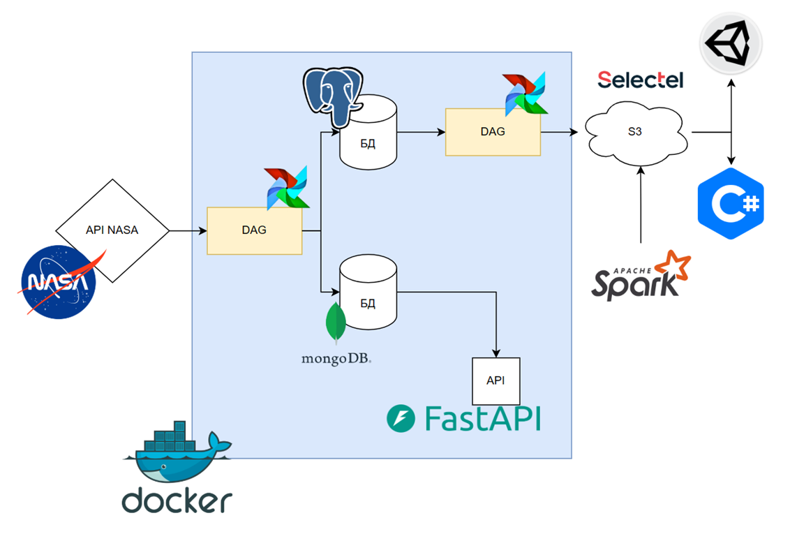

[🇷🇺 Русский](./README.md) | [🇬🇧 English](./README.en.md)

# 📘 NASA EPIC Data Pipeline

Этот проект представляет собой комплексный пайплайн для обработки данных, поступающих из NASA EPIC API со спутника DSCOVR. Пайплайн спроектирован в соответствии с принципами инженерного цикла данных, как описано в книге «Основы инженерии данных» (Джон Рис, Мэтт Хоусли).


Схема пайплайна

## 📦 Стек технологий

- **Apache Airflow 3.0:** Оркестрация пайплайнов.
- **PostgreSQL:** Хранение "сырых" данных.
- **MongoDB:** Хранение агрегированных данных (средние значения координат за день).
- **FastAPI:** REST API для доступа к данным.
- **Docker / Docker Compose:** Контейнеризация приложения.
- **Selectel S3:** Облачное хранилище для экспортированных данных CSV.
- **Pandas:** Преобразование и обработка данных.
- **PySpark:** Обработка данных в Data Lake (CSV-файлов из S3).

## 🔧 Как работает пайплайн

### DAG: `nasa_data_pipeline`

- Запускается ежедневно вечером.
- Получает данные за предыдущий день из NASA API.
- Сохраняет полные данные в PostgreSQL.
- Вычисляет средние значения координат и сохраняет их в MongoDB.

### DAG: `yearly_export_dag`

- Запускается в конце года (31 декабря).
- Извлекает данные за год из PostgreSQL.
- Сохраняет их в CSV-файл и загружает в Selectel S3.
- Обрабатывает CSV с использованием PySpark.

## 🌐 API

Доступ к данным обеспечивается через FastAPI:

- `GET /` — Проверка доступности API.
- `GET /records` — Получение всех агрегированных записей.
- `GET /records/{id}` — Получение записи по ObjectId.

Документация доступна по адресу: [http://localhost:8000/docs](http://localhost:8000/docs)

## 🐳 Быстрый старт

1. **Клонируйте репозиторий:**

```bash
git clone https://github.com/georgiymironenko/data-nasa-pipeline.git
cd data-nasa-pipeline
```

2. **Настройте окружение:**

- Создайте файл `.env` на основе `.env.example`.
- Укажите ваш NASA API ключ:

```env
NASA_API_KEY=your_nasa_api_key_here
```

3. **Запустите проект:**

```bash
docker-compose up --build
```

4. **Настройка соединений в Airflow:**

Перейдите в интерфейс Airflow: [http://localhost:8080](http://localhost:8080)

- Зайдите: `Admin > Connections > Add Connection`

Создайте соединение для MongoDB:
- Conn ID: `mongo_default`
- Conn Type: `Mongo`
- Host: `mongodb`
- Login: `airflow`
- Password: `root`
- Port: `27017`

Создайте соединение для PostgreSQL:
- Conn ID: `data_nasa_base`
- Conn Type: `Postgres`
- Host: `postgres`
- Login: `airflow`
- Password: `airflow`
- Port: `5432`
- Schema: `postgres`

5. **Доступ к сервисам:**

| Сервис        | Адрес                        | Логин / Пароль       |
|---------------|------------------------------|-----------------------|
| Airflow       | http://localhost:8080        | airflow / airflow     |
| FastAPI       | http://localhost:8000/docs   | —                     |
| Mongo Express | http://localhost:8081        | admin / root          |

## 🗂 S3 + Airflow

1. **Добавьте переменные в Airflow:**

- `data_nasa_api` — ключ NASA API.
- `AWS_ACCESS_KEY_ID`, `AWS_SECRET_ACCESS_KEY` — ключи от Selectel S3.

2. **Убедитесь, что установлен `boto3`:**

Если необходимо — добавьте `boto3` в `requirements.txt` Airflow и пересоберите контейнер.

## 📘 Каталог данных

Данные поступают из NASA API:

```
https://api.nasa.gov/EPIC/api/natural/date/2019-05-30?api_key=DEMO_KEY
```

Пример ответа:

```json
"date": "2025-05-23 01:27:51",
"dscovr_j2000_position": {
  "x": 934134.275255,
  "y": 1072103.780608,
  "z": 512460.978068
},
```

Каждая запись также содержит ссылку на снимок Земли с камеры спутника:

```
https://api.nasa.gov/EPIC/archive/natural/2019/05/30/png/epic_1b_20190530011359.png?api_key=DEMO_KEY
```

## 🧠 Автор

**Георгий Мироненко**, 18 лет  
Проект вдохновлён книгой *«Основы инженерии данных»*

## 📝 Лицензия

Этот проект распространяется под лицензией **MIT**.
